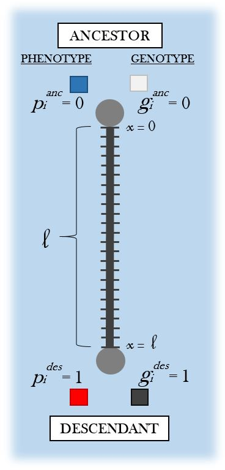

<!--rmarkdown::html_vignette

html_document:
    theme: spacelab
    highlight: neon
    -->

<!-- ########################################################################################################## -->
## Introduction
<!-- ########################################################################################################## -->

The *treeWAS* R package allows users to apply our phylogenetic tree-based appraoch to Genome-Wide Association Studies (GWAS) to microbial genetic and phenotypic data. *treeWAS* aims to identify genetic variables that are statistically associated with a phenotypic trait of interest and can be applied to data from both bacteria and viruses. 

***

<!-- ########################################################################################################## -->
## The *treeWAS* Approach
<!-- ########################################################################################################## -->

The approach adopted within *treeWAS* uses data simulation to identify a null distribution of association score statistics and 
disentangle genuine associations, with statistical significance and evolutionary support, from a noisy background of chance associations. 

A central aim of *treeWAS* is to control for the confounding effects of population stratification; that is, the overlap between the clonal population structure and the phenotypic distribution which gives rise to spurious associations. This is accomplished 
through the identification of a null distribution of association score statistics derived from simulated data. Data is 
simulated in such a way as to maintain both the population stratification and genetic composition of the dataset under analysis, 
but without recreating the "true" associations beyond those expected to arise from these cofounding factors. The null dataset is
simulated using the phylogenetic tree of the real dataset, as well as the original homoplasy distribution including the
number of substitutions per site due to both mutation and recombination. 

Association score statistics are calculated for both the real and the simulated datasets. The null distribution is drawn from 
the association scores of the simulated dataset. At the upper tail of this null distribution, a threshold of significance is
identified, according to a base p-value corrected for multiple testing. Any loci in the real dataset that have association score
values lying above this threshold are deemed to be significantly associated to the phenotype. 

<!-- ########################################################################################################## -->
### Tests of Association
<!-- ########################################################################################################## -->

By default, three measures of association are used to identify significant loci within *treeWAS*.

<!--  -->

